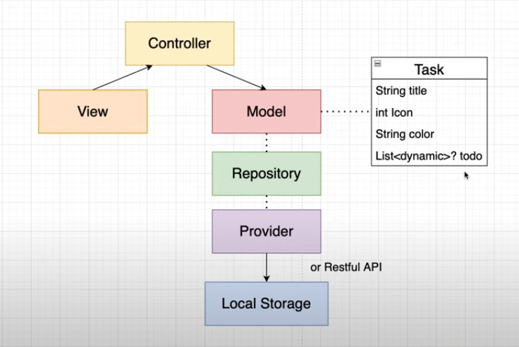

# Tasky

    

Your modern task management application made with flutter and GetX.

## Try the app

To try the app please visit the [releases](https://github.com/PIKO9545/Tasky/releases/tag/v1.0.0) page.

## Architecture

In this app the MVC architecture was used.

we have a task model that contains multiple todos, a title, an icon and a color. (as shown in the diagram below)

The provider communicates with the local storage service, and it's defined functions are used in the repository for a better abstraction.

## Contributing

Pull requests are welcome. For major changes, please open an issue first to discuss what you would like to change.

Please make sure to update tests as appropriate.

## License

[MIT](https://choosealicense.com/licenses/mit/)
